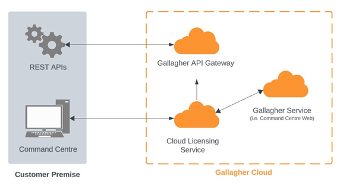

# Disclaimer
This document gives certain information about products and/or services provided by Gallagher Group Limited or its related companies (referred to as "Gallagher Group").

The information is indicative only and is subject to change without notice meaning it may be out of date at any given time.  Although every commercially reasonable effort has been taken to ensure the quality and accuracy of the information, Gallagher Group makes no representation as to its accuracy or completeness and it should not be relied on as such.  To the extent permitted by law, all express or implied, or other representations or warranties in relation to the information are expressly excluded. 

Neither Gallagher Group nor any of its directors, employees or other representatives shall be responsible for any loss that you may incur, either directly or indirectly, arising from any use or decisions based on the information provided.

Except where stated otherwise, the information is subject to copyright owned by Gallagher Group, and you may not sell it without permission.  Gallagher Group is the owner of all trademarks reproduced in this information.  All trademarks which are not the property of Gallagher Group, are acknowledged.

Copyright © Gallagher Group Ltd 2024.  All rights reserved.

Important: If you received this document along with your Command Centre installation media, or via another similar channel then it may be out of date with respect to the functionality/behaviour of the cloud, and of Gallagher Mobile Apps, which are distributed through platform App Stores and may be more recent than your Command Centre installation.

It is recommended you refer to the latest revision of this document, which can be found here: [https://gallaghersecurity.github.io/r/cloud-licensing-service](https://gallaghersecurity.github.io/r/cloud-licensing-service)

# Background
Cloud Licensing is both a web-based UI and backend cloud service for managing your site’s licenses and which operators those licenses are allocated for. Cloud Licensing fulfils the following:
* Allocate or revoke operator licenses.
* Check the existing cloud licenses for your site.
* Start trials for cloud-based solutions

## Reference: Other Gallagher Cloud Services
The API Gateway is an additional service, which has different characteristics from Gallagher's other cloud services (such as used for Mobile Credential enrolment). 

This document specifically discusses Cloud Licensing and does not cover these other cloud services. Please refer to the following document for technical, security and privacy information regarding Gallagher's other cloud services:

[https://gallaghersecurity.github.io/commandcentre-cloud-api-gateway.html](https://gallaghersecurity.github.io/commandcentre-cloud-api-gateway.html)

 
# Architecture
## Overview
The Cloud Licensing service in Command Centre includes a web-based User Interface (UI), which is displayed within Command Centre Client inside a WebView. Additionally, there is also a backend service REST API server for retrieving and updating data of your site’s cloud licenses.

 
# Regions
Cloud Licensing Portal and Service are hosted in Australia.

# Network Configuration Details
The Cloud Licensing Portal communicates using REST to the Cloud Licensing Service.

<u>**Cloud Licensing Portal:**</u>

DNS Address: **commandcentre-licensing-portal.security.gallagher.cloud**

<u>**Cloud Licensing Service:**</u>

DNS Address: **services.security.gallagher.cloud**

DNS Address: **services-au.security.gallagher.cloud**

Communication with the Cloud Licensing Portal and Cloud Licensing server take place solely using HTTPS over port 443.

## Firewall Recommendations
Firewall Recommendations for Command Centre API Gateway applies.

Configure your firewall to allow TCP outbound traffic on port 443 with a source of the workstations running Command Centre Client used to access Cloud Licensing Portal and Cloud Licensing Service.

# Data Storage and Retention
The cardholder names, descriptions and divisions displayed in the Cloud Licensing Portal are retrieved from Command Centre server through Command Centre API Gateway. The cardholder IDs are saved in the Cloud Licensing Service. Deleted and redacted cardholder IDs are also deleted in the Cloud Licensing Service.

If the site opts-in to receive emails from Gallagher, the email address will be saved securely in the cloud. If the site later opts-out, then the email address will be deleted.

# Data Transmission
All data transfer between the Command Centre server and Cloud Licensing Service is done via the Gallagher API Gateway and uses encrypted HTTPS.

We support only TLS 1.2 and TLS 1.3; older protocols are disallowed which mitigates most encryption-related security risks. 

Refer to the Gallagher API TIP for more information on this [https://gallaghersecurity.github.io/commandcentre-cloud-api-gateway.html](https://gallaghersecurity.github.io/commandcentre-cloud-api-gateway.html). 

## Data Visibility
It is important to note that the Gateway has visibility into REST API requests that transit through it. This is inherent to the nature of any reverse proxy/gateway solution; for example, if you configured an Azure Application Gateway, then Microsoft would have visibility of any traffic that was sent via that gateway as well.
REST API requests may contain any of the following:
* Cardholder names, description, divisions.

Gallagher policy is to never inspect, modify, save, log, or extract any sensitive or request-specific data such as the above.
Refer to the Gallagher API TIP for more information on this [https://gallaghersecurity.github.io/commandcentre-cloud-api-gateway.html](https://gallaghersecurity.github.io/commandcentre-cloud-api-gateway.html)

# Email
Site administrators may opt-in to receive emails from Gallagher about when subscription status, such as notifications when their cloud licenses are expiring, expired, or deactivated. Gallagher will not use this email address to send marketing or other types of emails.

Emails will be sent from: **licensing@security.gallagher.io**

# Security Controls
## Cloud Services
Our cloud services are securely hosted using Amazon Web Services. They are isolated from other Gallagher or external services using an AWS Virtual Private Cloud.

Strict firewall and access control rules are in place protecting all administrative functions and other endpoints.

All administrative users accessing our cloud infrastructure require two-factor authentication and strong passwords.

Services within the cloud environment are only allowed access to the minimum set of resources they require to function (e.g., they are only allowed to fetch and connect to the sole database / key storage they require and cannot access resources for any other services).

Platform updates (for example Operating System security patches) are applied on a daily basis, where required. We employ automated scanning tools that alert if any third-party software components we use are identified in a vulnerability database such as (but not limited to) the public CVE database.

## Authentication and Authorization
The Cloud Licensing Portal uses short-lived JSON Web Tokens (JWT) to authenticate and authorize with the Cloud Licensing Service. It is used to ensure that the site can only view and modify cloud licenses on their own Command Centre servers.

The Cloud License service also uses digital certificates and digital signatures to ensure that the Command Centre server trusts the identity and validity of the request.

# Monitoring and Response
We employ automated analysis of both application and database logs, continuous monitoring of CPU, disk and network resource usage and application-specific health monitoring.

Alerts are automatically generated and immediately sent to Gallagher. These alerts, along with service status, are monitored 24 hours per day.

Notice of any incidents or outages that may affect customers will be provided via our Channel Partners, or a direct email alert system, which customers may sign up to by contacting their Channel Partner.

# Security and Penetration Testing
Gallagher employ internal security and penetration testing staff, who hold a number of security certifications.
Our internal security staff hold a key role in the development of our cloud services, providing expertise, security reviews and internal penetration testing.

An external specialist security company will be engaged to do a comprehensive review annually, or more frequently with each major release as required. Prior reviews have been conducted by CyberCX (previously Insomnia Security), and executive summaries of the findings are available by request.

We are open to customer or otherwise externally arranged penetration testing, however we require advance notice and approval from Gallagher to avoid disruption of our services which may impact other customers.